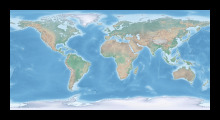

# GIS FROM COMMAND LINE

GDAL (Geospatial Data Abstraction Library) is a computer software library for reading and writing raster and vector geospatial data formats. But it is much more than that. This is how I use GDAL and a little scripting to make my own *Geographic Information Systems* from the command line.



## TABLE OF CONTENTS

1. [Raster](#1-raster)  
    1.1 [Resampling](#11-resampling)
    1.2 [Reprojecting](#12-reprojecting)
    1.3 [Georeferencing](#13-georeferencing)
    1.4 [Clipping](#14-clipping)
    1.5 [Converting](#15-converting)  

## 1. Raster

### 1.1 Resampling

Use `gdalinfo` to resize raster by a factor of its original width.

```
file='HYP_HR_SR_OB_DR_1024_512.tif'
width=$(echo $(gdalinfo ${file} | grep "Size is" | sed 's/Size is //g' | sed 's/,.*$//g')/2 | bc)
gdalwarp -overwrite -ts ${width} 0 -r cubicspline ${file} ${file%.*}_${width}.tif
```

Downsample then upsample by the same factor to smooth raster (for making contour lines).

```
file='topo15.tif'
width1=$(echo $(gdalinfo ${file} | grep "Size is" | sed 's/Size is //g' | sed 's/,.*$//g')/10 | bc)
width2=$(echo $(gdalinfo ${file} | grep "Size is" | sed 's/Size is //g' | sed 's/,.*$//g')/1 | bc)
gdalwarp -overwrite -ts ${width1} 0 -r cubicspline ${file} /vsistdout/ | gdalwarp -overwrite -ts ${width2} 0 -r cubicspline /vsistdin/ ${file%_*}_${width1}_${width2}.tif
```

### 1.2 Reprojecting

Use EPSG code to transform from lat-long to Web Mercator projection.

```gdalwarp -overwrite -s_srs 'EPSG:4326' -t_srs 'EPSG:3857' HYP_HR_SR_OB_DR_1024_512.tif HYP_HR_SR_OB_DR_1024_512_3857.tif```

Use PROJ definition to transform from lat-long to van der Grinten projection.

```gdalwarp -overwrite -s_srs 'EPSG:4326' -t_srs '+proj=vandg +lon_0=0 +x_0=0 +y_0=0 +R_A +a=6371000 +b=6371000 +units=m no_defs' HYP_HR_SR_OB_DR_1024_512.tif HYP_HR_SR_OB_DR_1024_512_vandergrinten.tif```

Customize PROJ definition to transform from lat-long to an orthographic projection centered on Toronto.

```gdalwarp -overwrite -s_srs 'EPSG:4326' -t_srs '+proj=ortho +lat_0='43.65' +lon_0='-79.34' +ellps='sphere'' HYP_HR_SR_OB_DR_1024_512.tif HYP_HR_SR_OB_DR_1024_512_ortho_toronto.tif```

Shift prime meridian on a 0-360° raster and a -180-180° raster.

```gdalwarp -overwrite -s_srs 'EPSG:4326' -t_srs '+proj=latlong +datum=WGS84 +pm=180dE' HYP_HR_SR_OB_DR_1024_512.tif HYP_HR_SR_OB_DR_1024_512_180pm.tif```

```gdalwarp -overwrite -s_srs 'EPSG:4326' -t_srs '+proj=longlat +ellps=WGS84 +pm=-360 +datum=WGS84 +no_defs +lon_wrap=360 +over' HYP_HR_SR_OB_DR_1024_512.tif HYP_HR_SR_OB_DR_1024_512_180pm.tif```

### 1.3 Georeferencing

Georeference by extent.

```gdal_translate -a_ullr -180 90 180 -90 HYP_HR_SR_OB_DR_1024_512.png HYP_HR_SR_OB_DR_1024_512_georeferenced.tif```

Georeference by ground control points.

```gdal_translate -gcp 0 0 -180 -90 -gcp 1024 512 180 90 -gcp 0 512 -180 90 -gcp 1024 0 180 -90 HYP_HR_SR_OB_DR_1024_512.png HYP_HR_SR_OB_DR_1024_512_georeferenced.tif```

Georeference and transform in one step.

```gdal_translate -a_ullr -180 90 180 -90 HYP_HR_SR_OB_DR_1024_512.png /vsistdout/ | gdalwarp -overwrite -t_srs 'EPSG:4326' /vsistdin/ HYP_HR_SR_OB_DR_1024_512_crs.tif```

### 1.4 Clipping

Clip to bounding box using `gdalwarp` or `gdal_translate`.

```gdalwarp -overwrite -dstalpha -te -94 42 -82 54 HYP_HR_SR_OB_DR_1024_512.tif HYP_HR_SR_OB_DR_1024_512_clipped.tif```

```gdal_translate -projwin -94 54 -82 42 HYP_HR_SR_OB_DR_1024_512.tif HYP_HR_SR_OB_DR_1024_512_clipped.tif```

Clip to vector features selected by SQL.

```gdalwarp -overwrite -dstalpha -crop_to_cutline -cutline 'natural_earth_vector.gpkg' -csql 'SELECT geom FROM ne_110m_ocean' HYP_HR_SR_OB_DR_1024_512.tif HYP_HR_SR_OB_DR_1024_512_clipped.tif```

Clip to raster mask using `gdal_calc.py`.

```
# make raster mask by setting values greater than 0 to 1
gdal_calc.py --overwrite --type=Int16 --NoDataValue=0 -A HYP_HR_SR_OB_DR_1024_512_A.tif --outfile=HYP_HR_SR_OB_DR_1024_512_mask.tif --calc="1*(A>0)"

# make raster mask by keeping values greater than 0
gdal_calc.py --overwrite --NoDataValue=0 -A HYP_HR_SR_OB_DR_1024_512_A.tif --outfile=HYP_HR_SR_OB_DR_1024_512_mask.tif --calc="A*(A>0)"

# clip to mask
gdal_calc.py -A HYP_HR_SR_OB_DR_1024_512.tif -B HYP_HR_SR_OB_DR_1024_512_mask.tif --outfile="HYP_HR_SR_OB_DR_1024_512_clipped.tif" --overwrite --type=Float32 --NoDataValue=0 --calc="A*(B>0)"
```

Add rasters with `gdal_calc.py`.

```
# add where raster A is greater than zero.
gdal_calc.py --overwrite -A HYP_HR_SR_OB_DR_1024_512_A.tif -B HYP_HR_SR_OB_DR_1024_512_B.tif --outfile=HYP_HR_SR_OB_DR_1024_512_A_B.tif --calc="((A>0)*A)+B"

# add with logical operator
gdal_calc.py --overwrite -A HYP_HR_SR_OB_DR_1024_512_A.tif --outfile=HYP_HR_SR_OB_DR_1024_512_100_150.tif --calc="A*logical_and(A>100,A<150)"
```

### 1.5 Converting

Use `gdal_translate` to convert from GeoTIFF to VRT.

```gdal_translate -if 'GTiff' -of 'VRT' HYP_HR_SR_OB_DR_1024_512.tif HYP_HR_SR_OB_DR_1024_512.vrt```

Use `gdalwarp` to convert from GeoTIFF to regular TIFF (use with programs like imagemagick).

```gdalwarp -overwrite -dstalpha --config GDAL_PAM_ENABLED NO -co PROFILE=BASELINE -f 'GTiff' -of 'GTiff' HYP_HR_SR_OB_DR_1024_512.tif HYP_HR_SR_OB_DR_1024_512.tif```

Make mosaic from two or more raster images.

```gdal_merge.py -o mosaic.tif part1.tif part2.tif part3.tif part4.tif```

