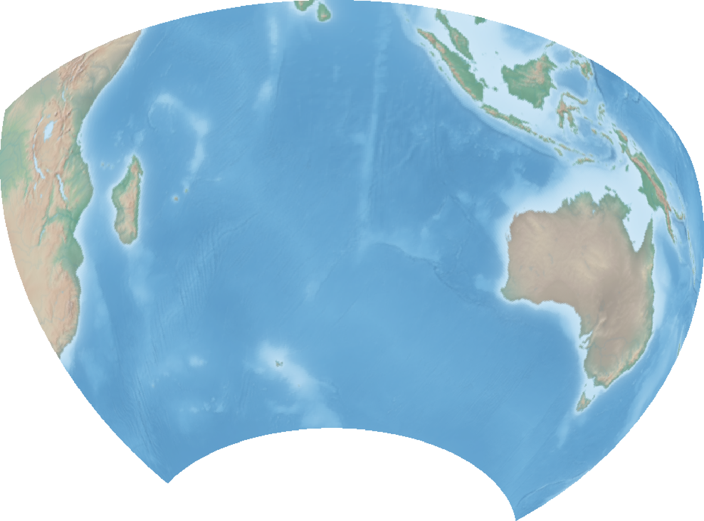
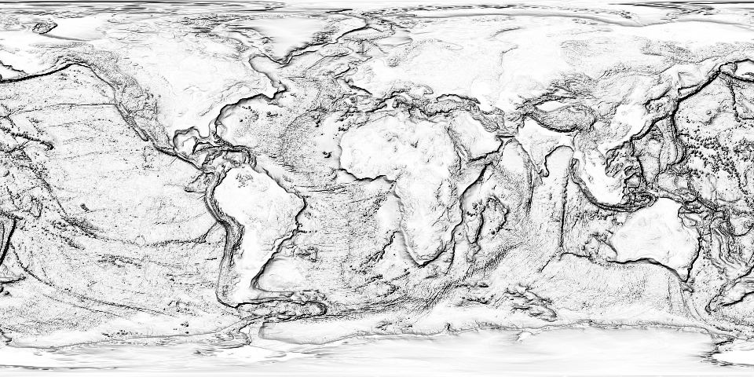
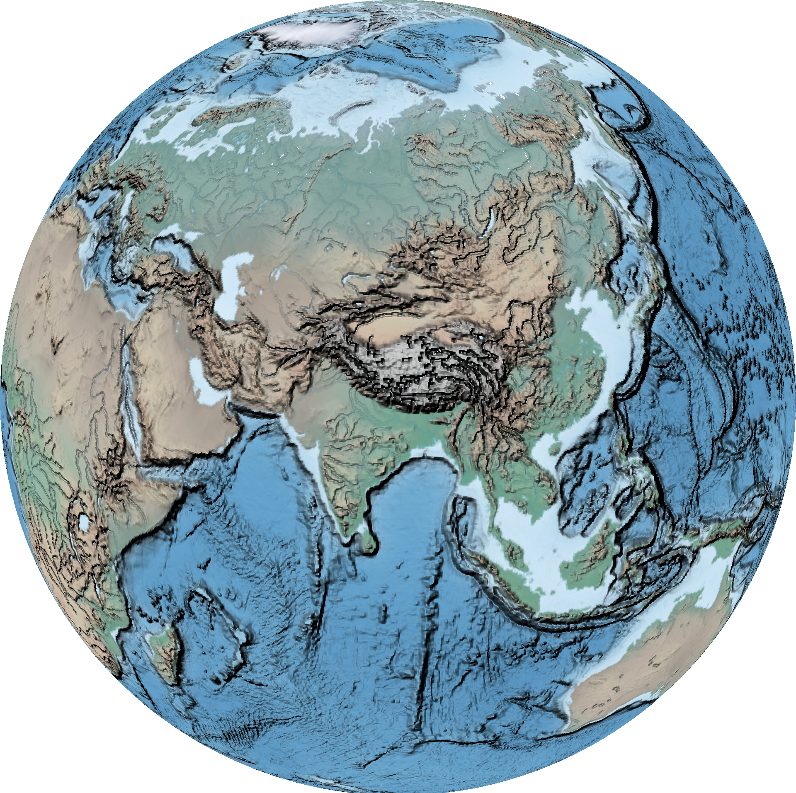

# GIS FROM COMMAND LINE

This is how I use a few open source Linux tools and a little BASH scripting to make my own *Geographic Information Systems* from the command line. I describe and illustrate how to accomplish the most common tasks in GIS and a lot of extras I came up with over the years.


## TABLE OF CONTENTS

1. [Raster](#1-raster)  
    1.1 [Resampling](#11-resampling)  
    1.2 [Reprojecting](#12-reprojecting)  
    1.3 [Geoprocessing](#13-geoprocessing)  
    1.4 [Converting](#14-converting)  

2. [Vector](#2-vector)  
    2.1 [Selecting](#21-selecting)  
    2.2 [Reprojecting](#22-reprojecting)  

3. [ImageMagick for Mapmakers](https://github.com/geographyclub/imagemagick-for-mapmakers#readme)

4. [Weather to Video: scripts to download & animate weather data ](https://github.com/geographyclub/weather-to-video)

5. [American Geography: PostGIS + Leaflet with census data](https://github.com/geographyclub/american-geography#readme)

## 1. Raster

GDAL (Geospatial Data Abstraction Library) is a computer software library for reading and writing raster and vector geospatial data formats.

### 1.1 Resampling

Resize the Natural Earth hypsometric raster to a web-safe width while keeping the aspect ratio. This will be our example raster.  
```bash
file='HYP_HR_SR_OB_DR.tif'
width=1920
gdalwarp -overwrite -ts ${width} 0 -r cubicspline ${file} hyp.tif
```


Resize raster as a fraction of its original size using output from *gdalinfo*.  
```gdalwarp -overwrite -ts $(echo $(gdalinfo hyp.tif | grep "Size is" | sed 's/Size is //g' | sed 's/,.*$//g')/10 | bc) 0 -r cubicspline hyp.tif hyp_192.tif```

### 1.2 Reprojecting

Set prime meridian on 0-360° raster.  
```gdalwarp -overwrite -ts 1920 0 -s_srs 'EPSG:4326' -t_srs "+proj=longlat +ellps=WGS84 +pm=-360 +datum=WGS84 +no_defs +lon_wrap=360 +over" hyp.tif hyp_180pm.tif```

Set prime meridian on -180-180° raster by desired degree.  
```bash
file='hyp.tif'
prime=180
gdalwarp -overwrite -ts 1920 0 -s_srs 'EPSG:4326' -t_srs "+proj=latlong +datum=WGS84 +pm=${prime}dE" ${file} ${file%.*}_180pm.tif
```


Set prime meridian by desired placename. Use *ogrinfo* to query the Natural Earth geopackage.  
```bash
file='hyp.tif'
name='Toronto'
prime=$(ogrinfo /home/steve/maps/naturalearth/packages/natural_earth_vector.gpkg -sql "SELECT round(ST_X(ST_Shift_Longitude(geom))) FROM ne_10m_populated_places WHERE nameascii = '${name}'" | grep '=' | sed -e 's/^.*= //g')
gdalwarp -overwrite -ts 1920 0 -s_srs 'EPSG:4326' -t_srs "+proj=latlong +datum=WGS84 +pm=${prime}dE" ${file} ${file%.*}_${prime}pm.tif
```


Transform from lat-long to the popular Web Mercator projection using EPSG code, setting extent between -85* and 80* latitude.  
```bash
file='hyp.tif'
proj='epsg:3857'
gdalwarp -overwrite -dstalpha --config OGR_ENABLE_PARTIAL_REPROJECTION TRUE -ts 1920 0 -s_srs 'EPSG:4326' -t_srs ${proj} -te -180 -85 180 80 -te_srs EPSG:4326 ${file} ${file%.*}_"${proj//:/_}".tif
```


Transform from lat-long to the Times projection using PROJ definition.  
```bash
file='hyp.tif'
proj='+proj=times'
gdalwarp -overwrite -dstalpha --config OGR_ENABLE_PARTIAL_REPROJECTION TRUE -ts 1920 0 -s_srs 'EPSG:4326' -t_srs "${proj}" ${file} ${file%.*}_"$(echo ${proj} | sed -e 's/+proj=//g' -e 's/ +.*$//g')".tif
```


Transform from lat-long to an orthographic projection with a custom PROJ definition. Again use *ogrinfo* to query the Natural Earth geopackage.  
```bash
file='hyp.tif'
name='Seoul'
xy=($(ogrinfo /home/steve/maps/naturalearth/packages/natural_earth_vector.gpkg -sql "SELECT round(ST_X(ST_Centroid(geom))), round(ST_Y(ST_Centroid(geom))) FROM ne_10m_populated_places WHERE nameascii = '${name}'" | grep '=' | sed -e 's/^.*= //g'))
gdalwarp -overwrite -dstalpha --config OGR_ENABLE_PARTIAL_REPROJECTION TRUE -ts 1920 0 -s_srs 'EPSG:4326' -t_srs '+proj=ortho +lat_0="'${xy[1]}'" +lon_0="'${xy[0]}'" +ellps='sphere'' ${file} ${file%.*}_ortho_"${xy[0]}"_"${xy[1]}".tif
```


Center the orthographic projection on the centroid of a country using the same method.  
```bash
file='hyp.tif'
name='Ukraine'
xy=($(ogrinfo /home/steve/maps/naturalearth/packages/natural_earth_vector.gpkg -sql "SELECT round(ST_X(ST_Centroid(geom))), round(ST_Y(ST_Centroid(geom))) FROM ne_110m_admin_0_countries WHERE name = '${name}'" | grep '=' | sed -e 's/^.*= //g'))
gdalwarp -overwrite -dstalpha --config OGR_ENABLE_PARTIAL_REPROJECTION TRUE -ts 1920 0 -s_srs 'EPSG:4326' -t_srs '+proj=ortho +lat_0="'${xy[1]}'" +lon_0="'${xy[0]}'" +ellps='sphere'' ${file} ${file%.*}_ortho_"${xy[0]}"_"${xy[1]}".tif
```


Some other popular map projections and their PROJ definitions.  
| Name | PROJ |
|------|------|
| Azimuthal Equidistant | +proj=aeqd +lat_0=45 +lon_0=-80 +a=1000000 +b=1000000 +over |
| Lambert Azimuthal Equal Area | +proj=laea +lat_0=0 +lon_0=0 +x_0=0 +y_0=0 +datum=WGS84 +units=m |
| Lambert Conformal Conic | +proj=lcc +lon_0=-90 +lat_1=33 +lat_2=45 |
| Stereographic | +proj=stere +lon_0=-119 +lat_0=36 +lat_ts=36 |
| Van der Grinten | +proj=vandg +lon_0=0 +x_0=0 +y_0=0 +R_A +a=6371000 +b=6371000 +units=m |

Georeference by extent.  
```gdal_translate -a_ullr -180 90 180 -90 HYP_HR_SR_OB_DR_1024_512.png HYP_HR_SR_OB_DR_1024_512_georeferenced.tif```

Georeference by ground control points.  
```gdal_translate -gcp 0 0 -180 -90 -gcp 1024 512 180 90 -gcp 0 512 -180 90 -gcp 1024 0 180 -90 HYP_HR_SR_OB_DR_1024_512.png HYP_HR_SR_OB_DR_1024_512_georeferenced.tif```

Georeference and transform in one step.  
```gdal_translate -a_ullr -180 90 180 -90 HYP_HR_SR_OB_DR_1024_512.png /vsistdout/ | gdalwarp -overwrite -s_srs 'EPSG:4326' -t_srs 'EPSG:3857' /vsistdin/ HYP_HR_SR_OB_DR_1024_512_crs.tif```

### 1.3 Geoprocessing

Clip raster to a bounding box using either *gdal_translate* or *gdalwarp*. Use the appropriate stereographic projection for each hemisphere.  
```gdal_translate -projwin -180 90 180 0 hyp.tif /vsistdout/ | gdalwarp -overwrite -dstalpha --config OGR_ENABLE_PARTIAL_REPROJECTION TRUE -ts 1920 0 -s_srs 'EPSG:4326' -t_srs '+proj=stere +lat_0=90 +lat_ts_0' /vsistdin/ hyp_north_stere.tif```


```gdalwarp -te -180 -90 180 0 hyp.tif /vsistdout/ | gdalwarp -overwrite -dstalpha --config OGR_ENABLE_PARTIAL_REPROJECTION TRUE -ts 1920 0 -s_srs 'EPSG:4326' -t_srs '+proj=stere +lat_0=-90 +lat_ts_0' /vsistdin/ hyp_south_stere.tif```


Clip raster to extent of vector geometries in the same way. Use North America Lambert Conformal Conic projection here.  
```bash
file='hyp.tif'
continent='North America'
extent=($(ogrinfo /home/steve/maps/naturalearth/packages/natural_earth_vector.gpkg -sql "SELECT ROUND(ST_MinX(geom)), ROUND(ST_MinY(geom)), ROUND(ST_MaxX(geom)), ROUND(ST_MaxY(geom)) FROM (SELECT ST_Union(geom) geom FROM ne_110m_admin_0_countries WHERE CONTINENT = '${continent}')" | grep '=' | sed -e 's/^.*= //g'))
gdalwarp -te ${extent[*]} ${file} /vsistdout/ | gdalwarp -overwrite -dstalpha --config OGR_ENABLE_PARTIAL_REPROJECTION TRUE -ts 1920 0 -s_srs 'EPSG:4326' -t_srs 'ESRI:102010' /vsistdin/ ${file%.*}_extent_$(echo "${extent[@]}" | sed 's/ /_/g').tif
```


Clip to vector geometry with *crop_to_cutline*. The cutline is the extent of the Indian Ocean so we center the projection on its centroid here.  
```bash
file='hyp.tif'
name='INDIAN OCEAN'
xy=($(ogrinfo /home/steve/maps/naturalearth/packages/natural_earth_vector.gpkg -sql "SELECT round(ST_X(ST_Centroid(geom))), round(ST_Y(ST_Centroid(geom))) FROM ne_110m_geography_marine_polys WHERE name = '${name}'" | grep '=' | sed -e 's/^.*= //g'))
gdalwarp -dstalpha -crop_to_cutline -cutline '/home/steve/maps/naturalearth/packages/natural_earth_vector.gpkg' -csql "SELECT Extent(geom) FROM ne_110m_geography_marine_polys WHERE name = '${name}'" ${file} /vsistdout/ | gdalwarp -overwrite -dstalpha --config OGR_ENABLE_PARTIAL_REPROJECTION TRUE -ts 1920 0 -s_srs 'EPSG:4326' -t_srs '+proj=ortho +lat_0="'${xy[1]}'" +lon_0="'${xy[0]}'" +ellps='sphere'' /vsistdin/ ${file%.*}_ortho_"${xy[0]}"_"${xy[1]}".tif
```



Make a shaded relief map from TOPO by setting zfactor, azimuth and altitude.  
```bash
zfactor=100
azimuth=315
altitude=45
gdaldem hillshade -combined -z ${zfactor} -s 111120 -az ${azimuth} -alt ${altitude} -compute_edges topo.tif topo_hillshade.tif
```



Multiply Natural Earth and shaded relief rasters, then take a closer look at the Himalayas.  
```bash
gdal_calc.py --overwrite -A topo_hillshade.tif -B hyp.tif --allBands B --outfile=hyp_hillshade.tif --calc="((A - numpy.min(A)) / (numpy.max(A) - numpy.min(A))) * B"

file='hyp_hillshade.tif'
name='HIMALAYAS'
xy=($(ogrinfo /home/steve/maps/naturalearth/packages/natural_earth_vector.gpkg -sql "SELECT round(ST_X(ST_Centroid(geom))), round(ST_Y(ST_Centroid(geom))) FROM ne_110m_geography_regions_polys WHERE name = '${name}'" | grep '=' | sed -e 's/^.*= //g'))
gdalwarp -overwrite -dstalpha --config OGR_ENABLE_PARTIAL_REPROJECTION TRUE -ts 1920 0 -s_srs 'EPSG:4326' -t_srs '+proj=ortho +lat_0="'${xy[1]}'" +lon_0="'${xy[0]}'" +ellps='sphere'' ${file} ${file%.*}_ortho_"${xy[0]}"_"${xy[1]}".tif
```



### 1.4 Converting

Use *gdalwarp* to convert from GeoTIFF to regular TIFF (use with programs like imagemagick).  
```gdalwarp -overwrite -dstalpha --config GDAL_PAM_ENABLED NO -co PROFILE=BASELINE -ts 1920 0 -f 'GTiff' -of 'GTiff' hyp.tif hyp_nogeo.tif```

Use *gdal_translate* to convert from GeoTIFF to JPEG, PNG and other image formats. Use *outsize* to set width and maintain aspect ratio of output image.  
```gdal_translate -outsize 1920 0 -if 'GTiff' -of 'JPEG' hyp.tif hyp.png```

```gdal_translate -outsize 1920 0 -if 'GTiff' -of 'PNG' hyp.tif hyp.png```

Resize and convert all geotiffs in the folder to png. This is how to make the example thumbnails.  
```bash
ls *.tif | while read file; do
  gdal_translate -of 'PNG' -outsize 1920 0 ${file} ${file%.*}.png
done
```

## 2. Vector

### 2.1 Selecting

Select some vector layers processed from the Natural Earth geopackage. These will be our example layers.  
```ogr2ogr -overwrite vectors.gpkg /home/steve/maps/naturalearth/packages/ne_110m_admin_0_boundary_lines_land_coastline_split1.gpkg countries```


Use *update* to add layers to our geopackage.  
```ogr2ogr -overwrite -update vectors.gpkg /home/steve/maps/naturalearth/packages/ne_110m_coastline_split1.gpkg coastline```

### 2.2 Reprojecting

Transform from lat-long to an orthographic projection, this time using *ogr2ogr* for vectors.  
```bash
file='vectors.gpkg'
layer='countries'
place='Cairo'
xy=($(ogrinfo /home/steve/maps/naturalearth/packages/natural_earth_vector.gpkg -sql "SELECT round(ST_X(ST_Centroid(geom))), round(ST_Y(ST_Centroid(geom))) FROM ne_10m_populated_places WHERE nameascii = '${place}'" | grep '=' | sed -e 's/^.*= //g'))
ogr2ogr -overwrite -skipfailures --config OGR_ENABLE_PARTIAL_REPROJECTION TRUE -t_srs '+proj=ortho +lat_0="'${xy[1]}'" +lon_0="'${xy[0]}'" +ellps='sphere'' ${layer}_ortho_"${xy[0]}"_"${xy[1]}".gpkg ${file} ${layer}
```


Center the orthographic projection on the centroid of a country.  
```bash
file='vectors.gpkg'
layer='countries'
place='Brazil'
xy=($(ogrinfo /home/steve/maps/naturalearth/packages/natural_earth_vector.gpkg -sql "SELECT round(ST_X(ST_Centroid(geom))), round(ST_Y(ST_Centroid(geom))) FROM ne_110m_admin_0_countries WHERE name = '${place}'" | grep '=' | sed -e 's/^.*= //g'))
ogr2ogr -overwrite -skipfailures --config OGR_ENABLE_PARTIAL_REPROJECTION TRUE -t_srs '+proj=ortho +lat_0="'${xy[1]}'" +lon_0="'${xy[0]}'" +ellps='sphere'' ${layer}_ortho_"${xy[0]}"_"${xy[1]}".gpkg ${file} ${layer}
```


### Geoprocessing

Clip feature by grid.  
```

```

### Converting

Convert vector layer to svg file using *ogrinfo* to get extent and *AsSVG* to write paths. These are the vector examples shown here.  
```bash
file='vectors.gpkg'
layer='countries'
width=1920
height=960

ogrinfo -dialect sqlite -sql "SELECT ST_MinX(extent(geom)) || CAST(X'09' AS TEXT) || (-1 * ST_MaxY(extent(geom))) || CAST(X'09' AS TEXT) || (ST_MaxX(extent(geom)) - ST_MinX(extent(geom))) || CAST(X'09' AS TEXT) || (ST_MaxY(extent(geom)) - ST_MinY(extent(geom))) FROM ${layer}" ${file} | grep -e '=' | sed -e 's/^.*://g' -e 's/^.* = //g' | while IFS=$'\t' read -a array; do
echo '<svg xmlns="http://www.w3.org/2000/svg" xmlns:xlink="http://www.w3.org/1999/xlink" height="'${height}'" width="'${width}'" viewBox="'${array[0]}' '${array[1]}' '${array[2]}' '${array[3]}'">' > ${file%.*}.svg
done
ogrinfo -dialect sqlite -sql "SELECT AsSVG(geom, 1) FROM ${layer}" ${file} | grep -e '=' | sed -e 's/^.*://g' -e 's/^.* = //g' | while IFS=$'\t' read -a array; do
  echo '<path d="'${array[0]}'" vector-effect="non-scaling-stroke" fill="#000" fill-opacity="1" stroke="#000" stroke-width="0.4px" stroke-linejoin="round" stroke-linecap="round"/>' >> ${file%.*}.svg
done
echo '</svg>' >> ${file%.*}.svg
```
